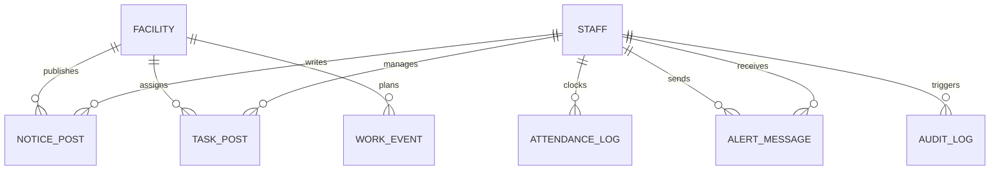

# Bomcare Suite ER Diagram

아동 사회복지시설 운영 사이트의 초기 RDBMS 초안입니다.

## 한국어 관계 요약

- `시설(FACILITY)` 1개는 여러 `공간(ROOM)` 을 가집니다.
- `시설(FACILITY)` 1개는 여러 `직원(STAFF)` 과 `보호 아동(CHILD)` 을 관리합니다.
- `직원(STAFF)` 은 하나 이상의 `역할(ROLE)` 을 가질 수 있고, 역할은 여러 `권한(PERMISSION)` 과 연결됩니다.
- `보호 아동(CHILD)` 1명은 여러 `사례기록(CASE_RECORD)` 과 `상담일정(COUNSEL_SESSION)` 을 가질 수 있습니다.
- `보호 아동(CHILD)` 1명은 여러 `보호자/연계기관(CHILD_GUARDIAN)` 정보를 가질 수 있습니다.
- `보호 아동(CHILD)` 1명은 여러 `학교 연계 기록(SCHOOL_LINK)` 과 `복약 기록(MEDICATION_RECORD)` 을 가질 수 있습니다.
- `시설(FACILITY)` 1개는 여러 `서비스 카탈로그(SERVICE_CATALOG)` 를 운영합니다.
- `보호 아동(CHILD)` 1명은 여러 `아동별 서비스 계획(CHILD_SERVICE_PLAN)` 을 가질 수 있습니다.
- `문서 템플릿(DOCUMENT_TEMPLATE)` 으로 여러 `생성 문서(GENERATED_DOCUMENT)` 를 만들 수 있습니다.
- `생성 문서(GENERATED_DOCUMENT)` 는 `결재 요청(APPROVAL_REQUEST)` 으로 이어지고, 결재 요청은 여러 `결재 단계(APPROVAL_STEP)` 를 가집니다.
- `공간(ROOM)` 은 여러 `안전 점검(SAFETY_CHECK)` 과 `근무 배치(SHIFT_ASSIGNMENT)` 기록을 가질 수 있습니다.

## 테이블 한글 매핑

| 영문 테이블 | 한글 의미 |
| --- | --- |
| `FACILITY` | 시설 |
| `ROOM` | 생활실/상담실/프로그램실 같은 공간 |
| `STAFF` | 직원 |
| `ROLE` | 역할 |
| `PERMISSION` | 권한 |
| `STAFF_ROLE` | 직원별 역할 연결 |
| `ROLE_PERMISSION` | 역할별 권한 연결 |
| `CHILD` | 보호 아동 |
| `CHILD_GUARDIAN` | 보호자/연계기관 |
| `SCHOOL_LINK` | 학교 연계 기록 |
| `MEDICATION_RECORD` | 복약 기록 |
| `SERVICE_CATALOG` | 시설 서비스 항목 |
| `CHILD_SERVICE_PLAN` | 아동별 서비스 계획 |
| `CASE_RECORD` | 사례기록 |
| `COUNSEL_SESSION` | 상담 일정/상담 기록 |
| `DOCUMENT_TEMPLATE` | 문서 템플릿 |
| `GENERATED_DOCUMENT` | 생성 문서 |
| `APPROVAL_REQUEST` | 결재 요청 |
| `APPROVAL_STEP` | 결재 단계 |
| `SAFETY_CHECK` | 안전 점검 |
| `SHIFT_ASSIGNMENT` | 근무 배치 |

```mermaid
erDiagram
    FACILITY ||--o{ ROOM : has
    FACILITY ||--o{ STAFF : employs
    FACILITY ||--o{ CHILD : protects
    ROLE ||--o{ STAFF_ROLE : grants
    STAFF ||--o{ STAFF_ROLE : receives
    ROLE ||--o{ ROLE_PERMISSION : owns
    PERMISSION ||--o{ ROLE_PERMISSION : maps
    CHILD ||--o{ CHILD_GUARDIAN : links
    CHILD ||--o{ SCHOOL_LINK : tracks
    CHILD ||--o{ MEDICATION_RECORD : takes
    FACILITY ||--o{ SERVICE_CATALOG : offers
    CHILD ||--o{ CHILD_SERVICE_PLAN : receives
    SERVICE_CATALOG ||--o{ CHILD_SERVICE_PLAN : plans
    STAFF ||--o{ CHILD_SERVICE_PLAN : manages
    CHILD ||--o{ CASE_RECORD : owns
    STAFF ||--o{ CASE_RECORD : writes
    CHILD ||--o{ COUNSEL_SESSION : attends
    STAFF ||--o{ COUNSEL_SESSION : leads
    FACILITY ||--o{ DOCUMENT_TEMPLATE : manages
    STAFF ||--o{ GENERATED_DOCUMENT : creates
    CHILD ||--o{ GENERATED_DOCUMENT : references
    DOCUMENT_TEMPLATE ||--o{ GENERATED_DOCUMENT : instantiates
    GENERATED_DOCUMENT ||--o{ APPROVAL_REQUEST : submits
    STAFF ||--o{ APPROVAL_REQUEST : reviews
    APPROVAL_REQUEST ||--o{ APPROVAL_STEP : contains
    STAFF ||--o{ APPROVAL_STEP : handles
    ROOM ||--o{ SAFETY_CHECK : inspects
    STAFF ||--o{ SHIFT_ASSIGNMENT : works
    ROOM ||--o{ SHIFT_ASSIGNMENT : covers

    FACILITY {
        bigint facility_id PK
        varchar facility_name
        varchar facility_type
        varchar phone
        varchar status
        datetime created_at
    }

    ROOM {
        bigint room_id PK
        bigint facility_id FK
        varchar room_name
        int capacity
        varchar room_type
        varchar status
    }

    STAFF {
        bigint staff_id PK
        bigint facility_id FK
        varchar login_id
        varchar staff_name
        varchar role_code
        varchar phone
        varchar employment_status
    }

    ROLE {
        bigint role_id PK
        varchar role_code
        varchar role_name
    }

    PERMISSION {
        bigint permission_id PK
        varchar permission_code
        varchar permission_name
    }

    STAFF_ROLE {
        bigint staff_role_id PK
        bigint staff_id FK
        bigint role_id FK
        varchar active_yn
    }

    ROLE_PERMISSION {
        bigint role_permission_id PK
        bigint role_id FK
        bigint permission_id FK
    }

    CHILD {
        bigint child_id PK
        bigint facility_id FK
        varchar child_name
        date birth_date
        varchar protection_status
        bigint current_room_id FK
    }

    CHILD_GUARDIAN {
        bigint child_guardian_id PK
        bigint child_id FK
        varchar guardian_type
        varchar guardian_name
        varchar phone
        varchar relation_note
    }

    SCHOOL_LINK {
        bigint school_link_id PK
        bigint child_id FK
        varchar school_name
        varchar teacher_name
        varchar contact_phone
        text shared_note
    }

    MEDICATION_RECORD {
        bigint medication_record_id PK
        bigint child_id FK
        varchar medication_name
        varchar dosage_note
        varchar medication_status
        datetime checked_at
    }

    SERVICE_CATALOG {
        bigint service_catalog_id PK
        bigint facility_id FK
        varchar service_name
        varchar service_category
        varchar target_group
        varchar service_status
    }

    CHILD_SERVICE_PLAN {
        bigint child_service_plan_id PK
        bigint child_id FK
        bigint service_catalog_id FK
        bigint manager_staff_id FK
        varchar plan_status
        date start_date
        date end_date
    }

    CASE_RECORD {
        bigint case_record_id PK
        bigint child_id FK
        bigint author_staff_id FK
        varchar case_type
        text summary
        varchar priority_level
        datetime recorded_at
    }

    COUNSEL_SESSION {
        bigint counsel_session_id PK
        bigint child_id FK
        bigint counselor_staff_id FK
        datetime scheduled_at
        varchar session_status
        text note
    }

    DOCUMENT_TEMPLATE {
        bigint template_id PK
        bigint facility_id FK
        varchar template_name
        varchar template_type
        varchar version_no
        varchar active_yn
    }

    GENERATED_DOCUMENT {
        bigint document_id PK
        bigint template_id FK
        bigint creator_staff_id FK
        bigint child_id FK
        varchar document_title
        varchar document_type
        varchar document_status
        datetime created_at
    }

    APPROVAL_REQUEST {
        bigint approval_request_id PK
        bigint document_id FK
        bigint reviewer_staff_id FK
        varchar approval_status
        datetime requested_at
        datetime reviewed_at
    }

    APPROVAL_STEP {
        bigint approval_step_id PK
        bigint approval_request_id FK
        bigint approver_staff_id FK
        int step_order
        varchar step_status
        datetime action_at
    }

    SAFETY_CHECK {
        bigint safety_check_id PK
        bigint room_id FK
        varchar check_type
        varchar check_status
        datetime checked_at
    }

    SHIFT_ASSIGNMENT {
        bigint shift_assignment_id PK
        bigint room_id FK
        bigint staff_id FK
        varchar shift_type
        datetime shift_start_at
        datetime shift_end_at
    }
```

## 이번 단계 핵심 테이블

- `FACILITY`: 시설 기본 정보
- `ROOM`: 생활실, 상담실, 프로그램실 같은 공간 관리
- `STAFF`: 직원 로그인과 권한
- `CHILD`: 보호 아동 기본 정보
- `CASE_RECORD`: 사례기록
- `COUNSEL_SESSION`: 상담 일정과 결과
- `DOCUMENT_TEMPLATE`: HWP/XLSX 템플릿
- `GENERATED_DOCUMENT`: 실제 생성된 문서
- `APPROVAL_REQUEST`: 관리자 검토와 승인 흐름
- `ROLE`, `PERMISSION`: 권한 설계
- `STAFF_ROLE`, `ROLE_PERMISSION`: 역할 기반 접근 제어
- `APPROVAL_STEP`: 결재 단계별 처리 이력

## 관계를 한국어로 읽는 예시

- `FACILITY ||--o{ ROOM`
  하나의 시설에는 여러 개의 공간이 속합니다.
- `CHILD ||--o{ CASE_RECORD`
  한 명의 아동에게 여러 사례기록이 누적됩니다.
- `CHILD ||--o{ CHILD_GUARDIAN`
  한 명의 아동에게 여러 보호자 또는 연계기관 정보가 연결될 수 있습니다.
- `CHILD ||--o{ SCHOOL_LINK`
  한 명의 아동에게 여러 학교 공유 기록이 쌓일 수 있습니다.
- `CHILD ||--o{ MEDICATION_RECORD`
  한 명의 아동에게 복약 기록이 반복적으로 저장됩니다.
- `FACILITY ||--o{ SERVICE_CATALOG`
  한 시설은 여러 서비스(상담, 교육, 자립 지원)를 운영합니다.
- `CHILD ||--o{ CHILD_SERVICE_PLAN`
  한 아동은 여러 서비스 계획에 참여할 수 있습니다.
- `SERVICE_CATALOG ||--o{ CHILD_SERVICE_PLAN`
  하나의 서비스는 여러 아동 계획에 매핑될 수 있습니다.
- `DOCUMENT_TEMPLATE ||--o{ GENERATED_DOCUMENT`
  한 개의 템플릿으로 여러 문서를 생성할 수 있습니다.
- `APPROVAL_REQUEST ||--o{ APPROVAL_STEP`
  한 건의 결재 요청은 여러 단계의 승인 흐름으로 나뉩니다.

## 다음 확장 후보

- 외부기관 연계 테이블
- 보호자/후견인 정보
- 복약 관리
- 급식/예산 집행
- 감사 로그

## 그룹웨어 핵심 모듈 관계 (추가)

### 추가 테이블 제안

- `NOTICE_POST` (공지게시판)
  - `notice_id PK`, `facility_id FK`, `writer_staff_id FK`, `title`, `content`, `pinned_yn`, `created_at`
- `TASK_POST` (업무게시판)
  - `task_id PK`, `facility_id FK`, `manager_staff_id FK`, `title`, `assignee_team`, `task_status`, `created_at`
- `WORK_EVENT` (일정)
  - `work_event_id PK`, `facility_id FK`, `title`, `owner_team`, `event_date`, `event_status`
- `ATTENDANCE_LOG` (근태)
  - `attendance_log_id PK`, `staff_id FK`, `work_date`, `clock_in_at`, `clock_out_at`, `attendance_status`
- `ALERT_MESSAGE` (알림·쪽지)
  - `alert_id PK`, `sender_staff_id FK`, `receiver_staff_id FK`, `message`, `read_yn`, `created_at`
- `AUDIT_LOG` (감사로그)
  - `audit_log_id PK`, `actor_staff_id FK`, `module_name`, `action_type`, `target_id`, `changed_at`

## 전자결재 MVP (휴가 신청 1종)

- 기본 양식: `휴가신청서` 1종
- 상태값: `임시저장`, `결재대기`, `반려`, `완료`
- 핵심 흐름:
  - 기안자 작성 -> 임시저장 또는 결재상신
  - 검토자 확인 -> 승인(완료) 또는 반려
  - 상태 변경 이벤트를 `AUDIT_LOG`에 기록
